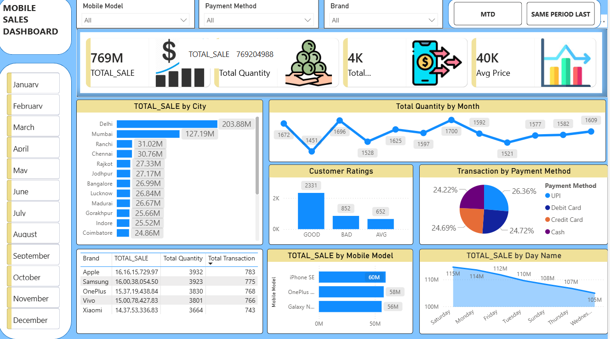

# Power BI Sales Dashboard

## 📊 Project Overview

This project is an interactive Sales Dashboard created using Microsoft Power BI to analyze sales performance and generate useful business insights.

## 🛠️ Tools & Technologies

- Microsoft Power BI
- Power Query
- DAX
- Data Visualization

## 📈 Key Analysis

- Total Sales
- Sales by Region
- Sales by Category
- Sales Trends
- Key Performance Indicators (KPIs)
- Payment Method Analysis
- Brand Analysis

## 🔍 Project Highlights

- Cleaned and transformed data using Power Query.
- Created calculated measures using DAX.
- Designed interactive charts and KPI visuals.
- Analyzed sales performance across different categories and regions.
- Created an easy-to-understand dashboard for business reporting.

## 🖥️ Dashboard Preview

## 🎯 Project Objective

The objective of this project is to analyze sales data and present important business information through an interactive Power BI dashboard.

## 📁 Project Files

- `AZAM_DASH.png` – Dashboard screenshot
- `sales_project.pbix` – Power BI project file

## 💡 Skills Demonstrated

- Data Cleaning
- Data Transformation
- Data Modeling
- DAX
- Power Query
- Data Visualization
- Dashboard Development
- Business Reporting
